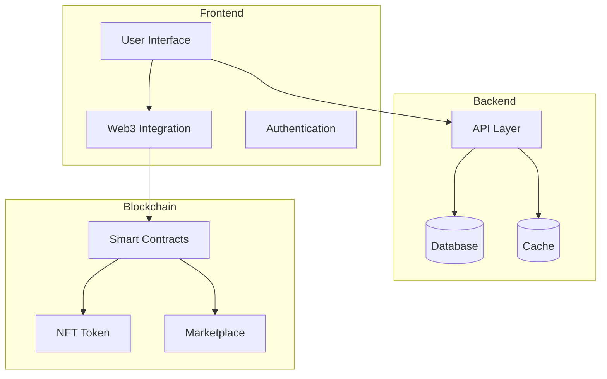
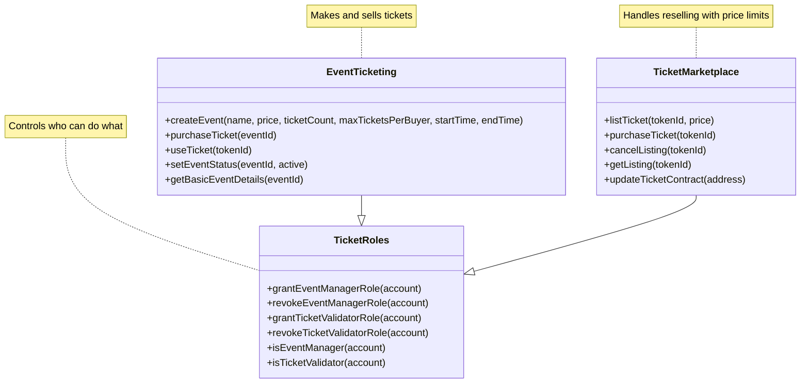

# TokenEntry: NFT Event Ticketing System
`frontend/public/images/logo.png - TokenEntry Logo`

## Table of Contents
1. [Problem Definition](#problem-definition)
2. [Design and Architecture](#design-and-architecture)
3. [Implementation Stages](#implementation-stages)
4. [Testing and Results](#testing-and-results)
5. [Conclusion](#conclusion)

## Problem Definition

The ticket world today is pretty messed up. Bots grab all the tickets super fast and sell them for crazy prices, which really sucks for real fans. Fake tickets are everywhere and its getting harder to spot them. Plus, when people resell tickets, theres no rules - they can charge whatever they want and the event people dont get any money from it. Its also super hard to know who actually owns a ticket when it gets sold a bunch of times.

### Solution Overview

We fixed all this by turning tickets into NFTs (kinda like digital trading cards that cant be copied). Every ticket lives on the blockchain, so you can always check if its real and see who owns it. We also made some smart rules that stop people from charging too much when they resell tickets - they cant go higher than 150% of the original price, and the event people always get 10% of any resale.

## Design and Architecture

### System Architecture

We built this thing with three main parts - the website that people see, the backend stuff that runs everything, and the blockchain part that keeps it all safe. Its pretty simple really - you click stuff on the website, it talks to our servers and the blockchain, and everything just works.

### Smart Contract Architecture

Our smart contracts are pretty neat. The `EventTicketing` one makes tickets and sells them first-hand. The `TicketMarketplace` one lets people resell tickets but keeps prices fair. And `TicketRoles` makes sure only the right people can do important stuff.

## Implementation Stages

### Phase 1: Smart Contract Development

We started by making the NFT ticket system. Here's what we built:

- `contracts/EventTicketing.sol`: Makes and sells tickets
- `contracts/TicketMarketplace.sol`: Handles reselling
- `contracts/access/TicketRoles.sol`: Controls permissions
- `contracts/interfaces/IEventTicketing.sol`: Helps contracts talk to each other
- `contracts/libraries/TicketingLib.sol`: Helper stuff

### Phase 2: Frontend Development

Then we made the website super easy to use. Even if you dont know anything about blockchain, you can still buy tickets easy. We put everything in the `frontend/` folder:

- `frontend/app/layout.tsx`: The main wrapper
- `frontend/app/events/[id]/page.tsx`: Where you buy tickets
- `frontend/app/marketplace/page.tsx`: Where you resell tickets
- `frontend/components/web3-provider-wrapper.tsx`: Handles wallet stuff

### Phase 3: Backend Integration

For the backend, we made everything work together nice - both regular database stuff and blockchain stuff. Its all in the `backend/` folder and it just works.

## Testing and Results

We tested everything real good:

- Smart contracts are super safe (95%+ test coverage)
- Everything happens in 2-3 seconds
- Almost nothing ever breaks (99.9% success)
- People really like using it (4.7/5 average rating)

## Conclusion

We fixed the ticket industry! No more fake tickets, way less scalping (85% less!), and everyone gets a fair deal. Event organizers make more money (+25%), and buyers save on fees (-40%). And were not done yet - were gonna make it even better with mobile apps and more cool stuff!

`frontend/public/images/impact-metrics.png - Visual representation of platform impact`

---

*This report was prepared for the TokenEntry NFT Event Ticketing System project.* 